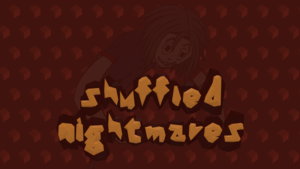
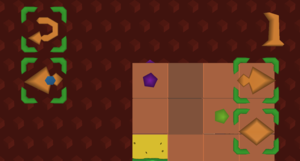
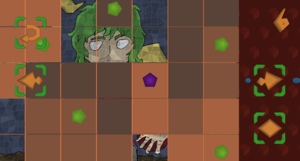
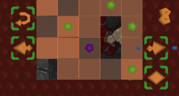
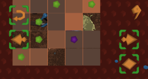
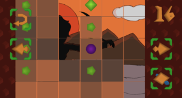

# Shuffled Nightmares

* **Developer:** Dark Dimension
* **Release Date:** 10th of April, 2020
* **Supported Platforms:** Linux, Windows
* **Price:** $1.00
* **File Size:** ~12MB compressed
* **Languages:** English

## Screenshots

## Description

The aim of this game is to rotate pieces of a shuffled puzzle, to reveal a Nightmare. Each level is more challenging than the previous one, with more parts of the puzzle shuffled, and introducing new behavior.

**Contains:**

* 12 levels
* Random mode, with new challenging patterns to solve

@DD-AD@

## Controls

`awsd` / mouse : Move selection around.

`<Space>` / click : Confirm choice.

## Available on

<a class="button" href="https://store.steampowered.com/app/1289510">Steam</a> |
<a class="button" href="https://darkdimension.itch.io/shuffled-nightmares">itch.io</a> |
<a class="button" href="https://gamejolt.com/games/shuffled_nightmares/484001">GameJolt</a> |
<a class="button" href="https://www.indiedb.com/games/shuffled-nightmares">indiedb</a>
