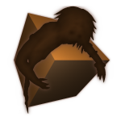
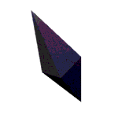
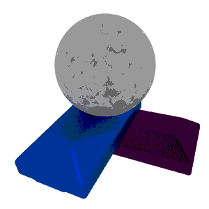

# Games

Video games made with a variety of tools and programming languages.

---

## The king is gone

linux/windows | keyboard/mouse | avdl | TBD

A game about running away, not because one has somewhere to go, but because one has somewhere they
don't want to be in.

The aim of this game is to run away as fast as possible. Doors block your path, which have to be unlocked
to continue. Each door will give a specific benefit, which will making escaping easier ... or harder.

> This project is still in active development.
> Only an alpha build is available in the following links.
> The first stable version is planned for December 2020.

<a class="button" href="https://darkdimension.itch.io/the-king-is-gone">Itch.io</a> |
<a class="button" href="https://gamejolt.com/games/the-king-is-gone/518056">GameJolt</a> |
<a class="button" href="https://www.indiedb.com/games/the-king-is-gone">IndieDB</a>

---

## [Shuffled Nightmares](shuffled_nightmares.html)

linux/windows | keyboard | avdl | 28.01.2020

The aim of this game is to rotate pieces of a shuffled puzzle, to reveal a Nightmare. Each level is more challenging than the previous one, with more parts of the puzzle shuffled, and introducing new behavior.

<a class="button" href="https://store.steampowered.com/app/1289510">Steam</a> |
<a class="button" href="https://darkdimension.itch.io/shuffled-nightmares">Itch.io</a> |
<a class="button" href="https://gamejolt.com/games/shuffled_nightmares/484001">GameJolt</a> |
<a class="button" href="https://www.indiedb.com/games/shuffled-nightmares">IndieDB</a>

---

## The collector

web | mouse/touch | javascript/pixijs | 28.01.2018

Small idle-like game.
The game was completed in about 7 days in order to practise my javascript and pixijs skills.

<a class="button" href="https://darkdimension.itch.io/the-collector">Itch.io</a>

---

## Dargite3D

linux | keyboard | C++/OpenGL | 16.03.2016
| dependencies: opengl, freeglut, glew

Pong clone. Pick from 12 available characters, 
and some available stages. Moddable enough to allow adding new characters,
and new stages.

<a class="button" href="https://notabug.org/tomtsagk/dargite3d">notabug</a> |
<a class="button" href="https://aur.archlinux.org/packages/dargite3d">aur</a>

---

## Blemish

android | java (android) | 8.11.2015

Puzzle game containing 27 different puzzles of increasing difficulty. 
includes a random mode for extra fun. The game is designed
to make the user explore it to understand how it works.

<a class="button" href="https://darkdimension.itch.io/blemish">Itch.io</a>

---

## Ritle

android | java (android) | 15.09.2014

Infinite runner. jump at the right time in order to avoid obstacles, and
collect the right items for the best score.

<a class="button" href="https://play.google.com/store/apps/details?id=com.darkdimension.ritle_run">Google Play Store</a>

---

## Dargite

android | java (android) | 08.10.2014

2D pong clone. Select from 12 characters with different abilities. supports game controllers
and multiplayer on the same device.

<a class="button" href="https://play.google.com/store/apps/details?id=com.darkdimension.dargite_new">Google Play Store</a>

---

## Town wars

android | java (android) | 29.05.2014

Keep attacking the enemy's field until you destroy all their structures.
Each character has different structure formation, which you can use as clues of where to attack next.
Play against a friend on the same device is available.

<a class="button" href="https://play.google.com/store/apps/details?id=com.darkdimension.town_wars">Google Play Store</a>

---

## Yarn chase

android | java (android) | 06.05.2014

Launcher-type game.
Throw the yarn and let the cat chase it.
Earn money and buy upgrades to launch further next time.

<a class="button" href="https://play.google.com/store/apps/details?id=com.darkdimension.yarn_chase">Google Play Store</a>

---

## Laughing veil

android | java (android) | 13.01.2014

Text-based role playing fantasy game.
You live in a world where magic is real.
You accidentally earn magic powers, and have to survive in a magic-hating city.

<a class="button" href="https://play.google.com/store/apps/details?id=com.darkdimension.laughingveil">Google Play Store</a>
