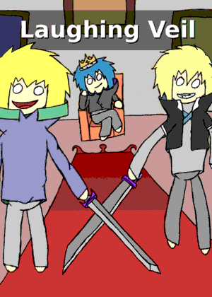
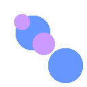
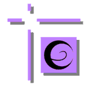

# Memories

Projects that were started but were either left unfinished or abandoned.

---

##laughing veil

hand-drawn | gimp | 2016.08

* chapter 1 - <a class="button" href="http://www.theduckwebcomics.com/Laughing_Veil/">theduckwebcomics.com</a>

> This project has been abandoned. New art is now focused to be part of future video games.

---

##just cause

this is a page i used to manage, it had one-page webcomics.
it is now abandoned, in favour of including such art in video games.

---

##avgdl (ex Clumsy Engine)

01.2018 - now | perl/python

an interesting concept for a video game engine
the aim is to make video games spending as little time as possible.

<a class="button" href="https://notabug.org/tomtsagk/avgdl_perl">notabug</a>

---

##interpret world project

04.2017 - 07.2017 | C program | unfinished

my new project to make the development of a video game even faster and easier.
the project has been abandoned, however it formed the bases for the
clumsy engine project.

---

##ddt - deedee tools

06.2016 - 2017 | C library | alpha

tools to aid in game development. the aim of these tools is to add an abstract
layer at drawing graphics, in such a way that it would be possible for a game
to be made once and compile everywhere (even on devices/platforms that do not
exist yet). it also includes a custom rasterizer, in order to allow 3d graphics
even on devices that do not support it. (so far it's only on a software level).

---

##byte world project

02.2017 - 04.2017

a project to create 3d graphics, while avoiding floats. although
 I'm mainly making this to practise the math behing rasterization,
my aim with this project is to make "lightweight" 3d graphics,
that can run even on a software level. obviously a game without floats has
lots of limitations (especially on rotations) but I find it creative

> This project has been fused with `ddt` and is no longer active.

---

##dark dimension launcher

01.2015 - 08.2015 | android launcher

android launcher, focused on launching apps fast and with little power consumption.
very small in size, and unique project.

> This project has been abandoned, there are a few bugs, but the launcher kinda works.

<a class="button" href="https://play.google.com/store/apps/details?id=com.darkdimension.darkdimensionlauncher">Google Play</a>

---

##tta - text to animation

03.2016 - 03.2016 | C program | unfinished

project to create animations using text. the logic is that you describe in a file how
objects animate inside a scene, and the program renders it.

> The project is left unfinished. I might continue it sometime later.
