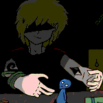
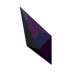

# Sounds

Sounds composed and used for video games.

---

## Lies

musescore | guitar, bass, drum | 01.04.2018

Composed to practise using multiple music instruments, and make a piece that sounds
like it came from a band. Contains an electric guitar, bass and drums.
Parts of it were used in the video game `Shuffled Nightmares`.

<a class="button" href="https://soundcloud.com/tom-tsagk/lies">soundcloud</a>

---

## Happy king

musescore | piano | 28.01.2018

Composed as a way to practise music theory. Parts of it were used in the video game
`The collector`.

<a class="button" href="https://soundcloud.com/tom-tsagk/happy-king">soundcloud</a>
